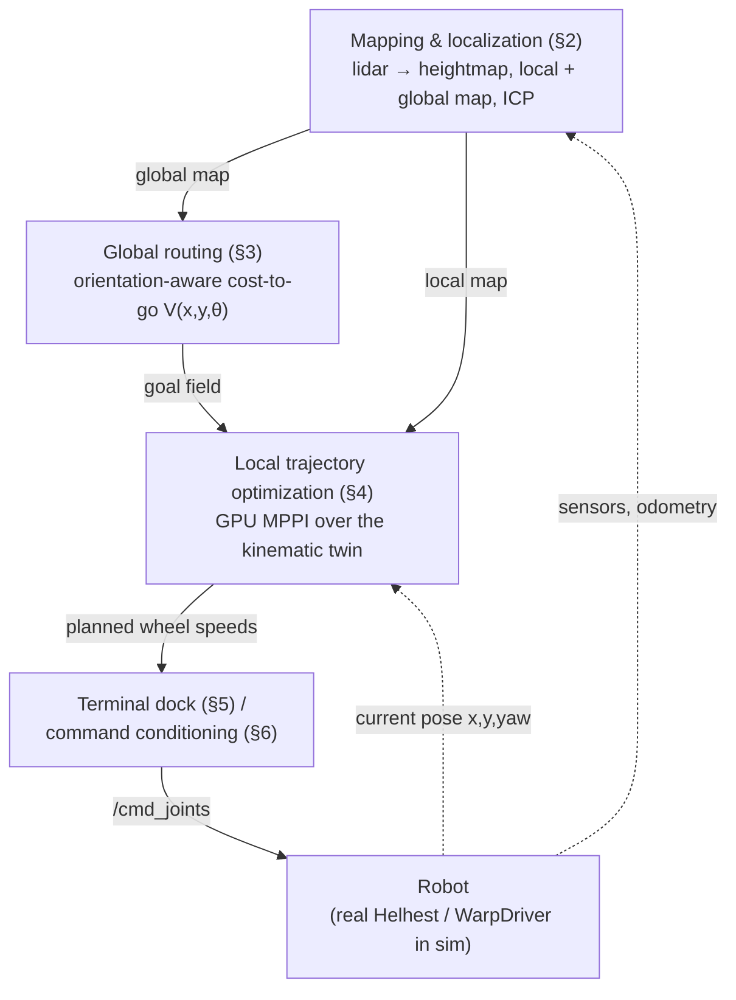

# Motion planning & control in `helhest_stack` — a guided tour

This is a lecture-style walkthrough of how `helhest_stack` decides where the **Helhest Junior**
robot should go and how it turns that decision into wheel commands. It is written for someone who
knows roughly what MPPI, value iteration and ICP *are* in the abstract, but has never opened this
codebase. Every claim below is anchored to a file — use the `path:line` references to jump to the
real code; nothing here should be taken as a substitute for reading it.

Scope: this document covers `helhest_stack`'s **motion** pipeline (`engine/`, `planning/`,
`control/`, `driver.py`) and just enough of `perception/`/`localization/` to explain where the
planner's inputs come from. It does not cover `ostrich` (the separate, full-dynamics simulator in
the sibling repo) or the differentiable-calibration half of the engine, except where needed for
context.

---

## 0. The big picture

Helhest is driven by a loop that repeats at 10 Hz (`dt = 0.1 s`, `dynamics.DT`,
[`src/helhest/dynamics.py:17`](../helhest_stack/src/helhest/dynamics.py)):

```
 point cloud                                                    wheel command
     |                                                                ^
     v                                                                |
 perception  --GridMap-->  [global map] --(coarse)--> cost-to-go  --V(x,y,theta)-->  MPPI  --(wl,wr)-->  command
 (heightmap,                  |                        (routing)         ^          (local             conditioning
  ICP loc.)                [local map]  --(fine)---------------------(rollouts)      trajectory           |
                                                                           |          optimization)         v
                                                                    terminal dock <-- "close to goal?"   /cmd_joints
```

Two ideas make this tractable on a robot's onboard GPU, and they show up *everywhere* in the code:

1. **The robot is simulated kinematically, not dynamically.** There is no contact solver, no
   friction cone LCP, no mass matrix inversion. Position/heading come from closed-form
   differential-drive kinematics; body tilt comes from a tiny analytic 3×3 Newton solve. This is
   what makes it possible to roll out **thousands of candidate trajectories per control tick**
   entirely on-device.
2. **Everything hot is a CUDA graph.** The per-tick MPPI refine and the per-window cost-to-go solve
   are captured once and *replayed* — no Python/host round-trip, no kernel-launch overhead, no
   host↔device sync in the loop. This forces some unusual code (device-side RNG counters,
   device-side loop conditions, device-side top-k selection by bisection) that will look strange
   until you see *why*: a single `.numpy()` read-back inside the hot loop would silently break
   graph capture and tank throughput.

### 0.1 The stack, drawn out

High-level view of the two loops that matter: the **outer loop** (map → route → command, updated
whenever the map/goal changes) and the **inner loop** (MPPI replanning against the robot's current
state, every 10 Hz tick). Section numbers point at the lecture that covers each box.



Module map (see also `helhest_stack/README.md` and `helhest_stack/CLAUDE.md`):

| module | role | key file |
|---|---|---|
| `engine/` | the kinematic twin: settle, step, rollout kernels | `step.py`, `simulator.py`, `robot.py` |
| `planning/` | global, orientation-aware routing field | `costtogo.py`, `lattice_solver.py` |
| `control/` | local trajectory optimization + final approach | `mppi.py`, `terminal.py`, `command.py`, `turn_adapt.py` |
| `driver.py` | "the real robot" stand-in (B=1, T=1 sim) | `driver.py` |
| `perception/` | points → heightmap → traversability, local/global maps, lidar sim | `pipeline.py`, `mapping/accumulate.py`, `gridmap.py` |
| `localization/` | ICP-based pose tracking that keeps the map registered | `localizer.py` |
| `dynamics.py` | the ONE place robot/solver params are defined | `dynamics.py` |

---

## 1. Lecture 1 — the vehicle model: a kinematic twin

Before any planning question makes sense we need a model of "if I command these wheel speeds, where
does the robot end up?" `helhest_stack` answers this with a **rigid tripod** resolved in two parts
(`src/helhest/engine/step.py`):

- **Controlled DOF** `(x, y, yaw)` — driven by the wheels.
- **Derived DOF** `(z, pitch, roll)` — resolved by settling the chassis onto the terrain, *given*
  `(x, y, yaw)`.

### 1.1 Controlled DOF: no-slip differential drive with a grip-weighted ICR

Helhest is a 3-wheel skid-steer (left, right, rear-caster-ish wheel; `wheel_pos` in
`robot.py:35`). For a commanded wheel-speed pair `(wL, wR)` the forward speed and yaw rate are:

```
vx = R * (wL + wR) / 2
wz = R * (wR - wL) / (2 * half_track * alpha)
vy = -x_icr * wz
```

(`step_predict`, `src/helhest/engine/step.py:437`). Two things are not textbook differential-drive:

- **`alpha` (turn resistance)** — skid-steer turning has to scrub the wheels sideways against the
  ground, and how much it resists depends on how much grip is on the ground: `alpha = 1 +
  k_turn * total_grip / (mass * g)`, where `total_grip = Σ mu_i * N_i` sums each wheel's
  friction-weighted normal load. Grippier terrain → understeers more. This is *why* the codebase
  keeps separate `K_TURN_INDOOR`/`K_TURN_OUTDOOR` calibration constants
  (`dynamics.py:28`) — a single constant is provably wrong across environments.
- **`x_icr` (instantaneous center of rotation)** — a grip-weighted average of the wheels' x-position,
  `x_icr = Σ(grip_i * wheel_x_i) / Σ grip_i`. If the rear wheel has less grip than the front two,
  the ICR shifts forward and the vehicle side-slips (`vy`) while turning, exactly as a real
  skid-steer does when its rear tire is slick.

Both `alpha` and `x_icr` are recomputed **every step from the current pose's normal loads**, not
fixed constants — this is what "friction-dependent ICR parameters" in the README refers to.

### 1.2 Derived DOF: quasi-static settle

Given the new planar pose, the chassis needs `(z, pitch, roll)` — however it would actually rest on
the terrain. This is a **3×3 Newton solve** (`settle()`, `step.py:129`) on the per-wheel clearance
residual `c_i = wheel_center_z - terrain_height(wheel_center_xy) - wheel_radius`, driven to zero for
all three wheels simultaneously. It runs in registers, few iterations, analytic Jacobian (no finite
differences) — this is what makes it cheap enough to call once per rollout-step, per rollout, times
thousands of rollouts, at 10 Hz.

Two solver fidelities share the same physics but trade iterations for speed
(`dynamics.py:43`, `:48`):

| | `planning_solver` (MPPI rollouts) | `execution_solver` (the driven robot) |
|---|---|---|
| Newton iterations | 6 | 12 |
| tolerance | loose (`1e-4`) | tight |
| why | thousands of rollouts/tick — speed matters | one robot — accuracy matters |

Both **must** share `dt` and `k_turn`, which is exactly why `dynamics.py`'s docstring calls itself
"the single source of truth" — the file exists because a *real bug* once had the planner assuming a
different `dt` than the thing executing the plan.

### 1.3 The wheel envelope: how obstacles becomes "terrain"

A wheel is not a point sampling the raw heightmap — it's a sphere of radius `wheel_radius` rolling
over it. `engine/envelope.py` precomputes, for every cell, an **arg-max dilation**: the highest
point a rolling sphere of that radius would contact, written into an `envelope` grid
(`BaseSimulator._dilate`, `simulator.py:113`). The settle and the normal-load/turning kernels all
sample `envelope`, not the raw `elevation` — a wall reads as terrain the wheel physically cannot
climb over, without the engine ever needing an explicit collision check.

Known limitation (documented in the README, worth internalizing before you trust the planner near
walls): this dilation is **isotropic** — a sphere of the full wheel radius (~0.35 m) is used in
*every* direction, including across the axle where the real wheel is only 0.05 m wide. The robot
therefore "feels" ~1.4 m wide instead of ~0.83 m and cannot hug walls or thread narrow gaps. Fine
for open terrain; not yet fixed for tight indoor navigation.

### 1.4 Feasibility: what makes a pose "bad"

Three signals fall out of the settle, and they are the *only* feasibility signals the whole stack
uses (no separate "is this cell an obstacle" classifier feeds the planner — see §2.3):

- **`clearance`** — the raw-terrain belly gap (`chassis_clearance`, `step.py:409`). Negative means
  high-centered.
- **`residual`** — how far the converged settle still is from zero (large ⇒ "no physically
  consistent rest pose was found", e.g. a wheel dangling over a cliff edge).
- **the stability envelope** — `|roll| > max_roll`, or `pitch` outside `[-max_pitch_up,
  max_pitch_down]`. Note the asymmetry and the sign convention: **climbing is nose-up = negative
  pitch** (`robot.py:71`, comment: `# [rad] nose-up = NEGATIVE pitch`), and the robot tolerates a
  steeper climb (25°) than descent (15°, front-heavy) or roll (15°, narrow track ⇒ strict).

All of these thresholds live on one `Robot` struct (`robot.py:26`), built once from
`RobotParams` and handed, unmodified, into *both* the cost-to-go feasibility kernel and the MPPI
cost kernel — the docstrings for both are emphatic about this being "one shared source". If you
ever need to change what "unsafe" means for Helhest, this is the one place to do it.

**By design, high-centering is detection-only.** The settle never lifts a wheel off the ground to
resolve belly contact — it just flags the pose invalid (`valid`) via the `clearance` check above.
This keeps the settle a clean 3-equation solve (needed for the differentiable calibration path
elsewhere in the engine) at the cost of the planner needing to actively *avoid* those poses rather
than have physics prevent them.

---

## 2. Lecture 2 — perceiving the world: heightmaps, and two different maps

### 2.1 The perception→planning seam

Perception's job is to turn point clouds into something the kinematic twin can settle onto: a
`GridMap` — deliberately minimal (`elevation[ny, nx]`, world `origin`, `cell` size, optional
`valid` mask; `perception/gridmap.py:19`). `perception/grid_adapter.py` converts this into the
engine's `GridParams` — a straight pass-through (both use the same min-corner / cell-center
convention), zero-copy when the elevation is already a device `wp.array`.

The full perception stack (`perception/pipeline.py`, `TerrainPipeline`) does considerably more than
the planner needs: `points → {max, mean, min, count} reductions → multigrid inpaint → optional
Gaussian smooth → traversability cost layers (slope/step/roughness) → obstacle inflation →
occlusion/support trust masking`. This produces a `TerrainMap`/`TerrainMapGPU` with a
`traversability` layer as one of its outputs.

**Important, and easy to miss:** the motion planner does **not** consume that `traversability`
cost layer. Read the top of `planning/costtogo.py` again — feasibility for planning comes from
*settling the actual robot* at every candidate pose and reading the same clearance/residual/tilt
checks described in §1.4, not from a thresholded traversability grid. The design rationale
(`costtogo.py:1`) is that this makes feasibility **direction-aware**: a side-slope is fine to climb
head-on (pitch — tolerated up to 25°) but dangerous to cross sideways (roll — tolerated only to
15°). A scalar per-cell "traversability cost" cannot express that asymmetry; a per-*pose* settle
can. `TerrainMap.as_gridmap()` still gives you the elevation layer to feed the planner — the cost
layer is for perception-side use (visualization, other consumers), not for gating the motion planner.

### 2.2 Two maps: global (drift-tolerant, coarse) vs local (fresh, fine)

This is the "global and local map representation" the assignment asked about, and it is a real
architectural split, motivated by a real constraint: **the planning cost-to-go and MPPI rollouts
must run on a *bounded* grid** (cost scales with cell count, and MPPI needs a fixed-size terrain
buffer for its captured graph), but the world the robot drives through is unbounded and the map it
builds keeps growing.

`demos/navigate_partial.py` is the clearest illustration (and is meant to mirror the real robot's
shape, not just be a toy):

- **Global routing map** — a `MultiScanMap` (or, on the real robot, `perception.mapping
  .DeviceMapAccumulator`, §2.4) accumulated over the whole drive, in world coordinates. It **tolerates
  drift**: the demo explicitly injects synthetic SLAM drift into only this map
  (`drift_scan`, `perception/lidar.py:98`) to prove the router is robust to it, because routing is
  *topological* — "is there a way around this obstacle" survives a smeared map even if exact
  geometry doesn't.
- **Local avoidance map** — built from only the freshest sensor data (the current scan, or the last
  `N` scans via a `deque`), in the **body frame**, drift-free by construction. Fine obstacle
  avoidance (the MPPI rollouts) reads this.

Concretely, each control tick (`navigate_partial.py:109`):

1. One lidar scan (`lidar_scan`, `perception/lidar.py:18`) — a horizon-sweep raycast against ground
   truth, producing `(obs_elev, known)` with genuine **occlusion shadows** (a cell behind a wall
   stays unknown, not "empty" — this is the thing the planner has to reason about).
2. The scan is folded into the global map (`mm.integrate`) — optionally drift-smeared.
3. A **fine window** (`win_m`, default 9 m, robot-centered) is cropped from the *local* map for the
   MPPI rollouts — unknown cells are inpainted **optimistically flat**
   (`elev = np.where(kn, elev, 0.0)`), since the alternative (treating unknown as blocked) would
   make the robot too timid to explore.
4. A **larger, coarser** window (`route_m`, default 16 m, `lat_coarsen`-downsampled by max-pooling
   — max-pooling, not averaging, so thin walls survive the coarsening) is cropped from the *global*
   map for the cost-to-go solve. Routing is topological, so it doesn't need fine resolution — this
   decoupling is what keeps the per-tick cost-to-go solve cheap even as the mapped area grows.
5. Both windows are expressed in **their own robot-centered local frame**, and the routing field is
   sampled by the MPPI cost kernel through a constant, precomputable frame offset (`sgrid` in
   `navigate_partial.py:90`) — constant because both windows snap to the same fine grid and share
   the robot's center cell, so the offset doesn't change frame-to-frame and can be baked into the
   captured CUDA graph.
6. If the **goal** lies outside the fine window, the cost-to-go field simply saturates there (see
   §3) and the MPPI cost's `explore_fallback` term (§4.3) pulls the robot toward it in a straight
   line — a "carrot" that the robot chases as the window scrolls with it.

The `WarpDriver` (§1, `driver.py`) in this demo plays **ground truth**: it never sees the map the
robot built, only the real scene — so a contact between the driver and a wall reveals a genuine
perception/mapping failure (optimism about an unseen obstacle), not a planning bug.

### 2.3 Localization: keeping the map registered

None of the above works if the map drifts out from under the robot's own pose estimate faster than
the router can tolerate. `localization/localizer.py`'s `Localizer` is a fairly standard
**odom-predicted, ICP-refined, drift-gated** scan-to-map tracker:

- `predict()` advances the previous corrected pose by a motion delta whose **translation** comes
  from wheel odometry and whose **rotation** comes from the IMU when available — because wheel-odom
  yaw is unreliable exactly when it matters most (in-place/skid turns), while the IMU can't give
  position. Each sensor supplies the DOF it's actually trustworthy on.
- `update()` crops a submap around the predicted pose, registers the current scan against it via
  ICP (with an optional multi-start **yaw sweep** to escape the wrong rotational basin under fast
  skid-steer yaw — `_align_yaw_sweep`, `localizer.py:231`), and **gates** the correction: reject if
  too few inliers, correction too large, or RMS residual too high. On rejection it falls back to
  the raw odometry prediction rather than accepting a bad registration.

This closes the loop the README describes: "`localization` closes the loop by tracking the robot's
pose (ICP) as it drives, so the map the planner routes over stays registered to the world."

### 2.4 On the real robot vs in these demos

The synthetic `MultiScanMap`/`lidar_scan` in `perception/lidar.py` exist to test the local/global
split cheaply, in numpy, against known ground truth. The real-robot equivalent of the accumulator is
`perception/mapping/accumulate.py`'s `DeviceMapAccumulator` — a device-resident **sparse voxel
hash** (open addressing, capacity sized to `max_points`) that carves stale points, folds in new
returns, crops to a robot-centered radius, and voxel-thins, entirely on-GPU, every frame. It supports
optional per-cell **recency** stamps and **seen-through streak** tracking so a caller (e.g. a
dynamic-object filter) can decide what to forget from actual sensor visibility — storage scales with
occupied cells, not with map volume, so an arbitrarily large accumulated map costs a few MB rather
than gigabytes.

---

## 3. Lecture 3 — global routing: the orientation-aware cost-to-go

### 3.1 Why not just "go toward the goal"?

Consider `worlds.py`'s `pocket_world`: a U-shaped cul-de-sac that *opens away* from the start. A
planner that only minimizes Euclidean distance-to-goal will drive straight into the closed side of
the U and stall — locally every step looks like progress. What's needed is a **global** notion of
distance that already accounts for the maze, computed once (or once per map update) and then handed
to the local optimizer as a cost field it can descend greedily. That's the cost-to-go's job.

### 3.2 What makes it "orientation-aware"

A plain 2D geodesic distance field is still not enough for this robot, because Helhest is
**forward-only** (the MPPI wheel-speed box is `[wmin=0, wmax]` — no reverse) and its feasibility is
**direction-dependent** (§1.4: side-slopes are fine head-on, dangerous sideways). So `CostToGo`
solves value iteration over a full **`(row, col, heading)` lattice**, `V(x, y, theta)`
(`planning/costtogo.py:189`), not just `(row, col)`. A pose from which the goal is unreachable *for
a forward-only robot approaching from that heading* correctly stays at `+inf`, and sampling `V` at
the robot's actual `(x, y, yaw)` penalizes exactly the misaligned approaches a 2D map can't express.

### 3.3 Building the feasibility field: settle every pose

`CostToGo.__init__` allocates a `ForwardSimulator` sized `batch_size = nx * ny * n_theta` and seeds
`start_pose` with **every lattice cell at every heading bin**, all with zero control
(`costtogo.py:236`). One `rollout_launch()` (n_steps=1) settles all of them in parallel — this reuses
*exactly* the same settle machinery as the MPPI rollouts, which is the point: feasibility for
routing and feasibility for local trajectory optimization are the same physics, read from the same
`Robot` struct, so they can never disagree about what's safe.

`_feasibility_kernel` (`costtogo.py:61`) then turns each pose's `(clearance, residual, roll, pitch)`
into:
- **`blocked`** (binary OR of the checks in §1.4), and
- **`graded_tilt`** = `roll_cost_weight * |roll| + pitch_cost_weight * |pitch|` — a *continuous*
  penalty, not just a binary gate, so that among several feasible routes the solver prefers flatter
  ones (roll weighted more heavily than pitch, since roll is the dangerous axis — see §1.4).

An optional **step gate** (`obstacle_step_m`, `_local_step_kernel` + `_step_gate_kernel`) hard-blocks
poses whose footprint contains a local elevation *prominence* taller than a threshold — this catches
thin vertical obstacles (a pole, a stick) that a wheels-only settle can straddle without noticing,
since nothing in the settle looks at the space *between* the wheels.

An optional **robust-feasibility erosion** (`robust_margin_m`/`robust_margin_deg`,
`_erode_feasible_kernel`) dilates the blocked set over a small `(dy, dx, dtheta)` tube: a pose is
blocked if *any* pose within a small disturbance neighborhood is blocked. This bakes in "the closed
loop can't correct a slip-heading error before the next replan" as a margin, and it's
**orientation-aware** too — the heading window wraps, so the margin itself is heading-dependent, not
a uniform radial inflation.

### 3.4 The value iteration itself

`LatticeValueSolver` (`planning/lattice_solver.py`) precomputes, **once, on the host**, a small table
of forward-arc motion primitives per heading bin: for each of a handful of turn rates capped by
`min_turn_radius` (so a tighter turn than the robot can physically execute is never offered), it
integrates the arc of length `step` and records the endpoint cell/heading, the arc's base cost
(its length), and the list of cells it *sweeps through* (`_build_primitives`, `:129`).

The relax kernel (`_relax_lattice_pose_kernel`, `:60`) is then one Bellman/min-relaxation sweep:

```
V_out[r,c,t] = min( V_in[r,c,t],
                     min over primitives p of  cost(p) + V_in[next(r,c,t,p)]  if p's swept cells are ALL free )
cost(p) = arc_length * (1 + tilt_weight * mean(tilt over p's swept cells))
```

Requiring the *whole swept arc* (not just the endpoint) to be clear is what stops a coarse-grid
solver from "jumping" through a thin wall between two sampled cells. Iterated to a fixed point (a
device-side `capture_while` loop, so **the whole convergence loop is captured in the CUDA graph** —
no host sync between sweeps), this gives the forward-only cost-to-go: a genuinely unreachable pose
keeps `+inf`, and `flatness_weight` (a single global knob, §"among feasible poses") trades path
length for smoother terrain along the way.

`trace_optimal()` (`lattice_solver.py:310`) is worth a mention even though it's not in the runtime
loop: it walks the *same* primitive-selection rule the relax kernel implicitly encodes, from a start
pose, to produce a drawable optimal path — mainly used by visualizers (e.g.
`perception/lidar.py`'s `run()` demo) to show a realistic driven route.

### 3.5 Cadence

The cost-to-go is expensive relative to one MPPI refine (it's a full value-iteration solve over
`cells_x * cells_y * n_theta` states) but does **not** need to run every control tick — only when
the map/goal changes meaningfully (once per window scroll, in `navigate_partial.py`). MPPI, by
contrast, replans (a few CEM refines) every tick. This cadence split — cheap-and-frequent local
optimization steered by an expensive-and-infrequent global field — is the same pattern used by many
sampling-based navigation stacks (e.g. classic move_base global/local planner pairs), just realized
here with GPU value iteration instead of A* and a costmap.

---

## 4. Lecture 4 — local trajectory optimization: GPU MPPI

### 4.1 The refine loop, at a glance

`MppiGpu` (`control/mppi.py`) owns a **nominal control sequence** `U[T, 2]` (per-step wheel speeds)
and repeatedly refines it:

```
sample   candidate wheel-speed sequences around U (+ some drawn from other priors)
rollout  all candidates through the ForwardSimulator (one fused kernel, §1)
cost     score each rollout with the cost function (§4.3)
reweight replace U with the mean of the lowest-cost ("elite") candidates
```

captured once as a CUDA graph (`_refine`, `mppi.py:518`) and replayed `n_refine` times per
`replan()` call. Each replay bumps a device-side RNG counter first, so fresh noise is drawn every
replay without needing to re-capture.

**Terminology note, because it will trip you up otherwise:** despite the name, the reweight step is
**not** the classical MPPI softmax/importance-weighted update. It's rank-based **CEM** (Cross-Entropy
Method): take the top-`elite_frac` lowest-cost candidates and set `U` to their unweighted mean
(`_cem_reweight`, `mppi.py:566`; `CostWeights`/`SamplingConfig` docstrings call it out explicitly:
"Rank-based, so the validity penalty can't blow up the weighting — invalid samples just don't make
the elite"). The file/class names stuck from the original design; the actual update rule is CEM.

### 4.2 How candidates are sampled

One rollout = one candidate (`n_cand = n_rollouts`). Per-step wheel speeds are parametrized by a
handful of **spline knots** spread evenly over the horizon (`_knot_bracket`, `mppi.py:156`) rather
than independent per-step noise — this is what makes sampled maneuvers *smooth, committed* turns
instead of jittery per-step noise that averages back to nothing. Candidates are drawn from three
different priors, split by index range (`_sample_target_wheel_omega_kernel`, `mppi.py:172`):

- **candidate 0**: the nominal, unperturbed (so the refine can never do worse than "keep going with
  the last plan").
- **`wide_frac` (default 25%)**: the **WIDE** prior — knots drawn *uniformly* over the whole
  `[wmin, wmax]` box, independent of the nominal. This is what lets the elite escape local minima:
  without it, Gaussian jitter around a bad nominal can get permanently stuck near it.
- **`straight_frac` (default off)**: the **STRAIGHT** prior — `wl == wr` exactly (zero differential),
  one common forward speed per knot. Seeded explicitly because "drive straight" is so often
  near-optimal that without an explicit seed, sampling noise alone produces a small, visible wobble
  even on a clear shot.
- **the remainder**: **NARROW** local refine — Gaussian spline-knot noise (`sigma_knot`) plus light
  per-step jitter (`sigma`) around the current nominal.

### 4.3 The cost function

`_cost_kernel` (`mppi.py:242`) sums, per rollout, over the horizon:

| term | what it penalizes | notes |
|---|---|---|
| `goal_terminal * V(pose_T)^2` | distance-to-go at the *end* of the horizon | the dominant "aim here" signal |
| `goal_running * mean(V(pose_t)^2)` | distance-to-go averaged over the whole horizon | "make progress every step", not just arrive eventually |
| `explore_fallback` | straight-line pull toward the raw goal `(x,y)` | only active where `V >= 0.9 * lattice_cap`, i.e. the cost-to-go field is *saturated* (goal outside the routed window, or genuinely unreachable in-window) — turns a flat, uninformative cost surface back into a gradient |
| `out_of_bounds` | depth past a 0.4 m soft margin at the grid edge | `V` is clamped off-grid, so without this term the goal term alone wouldn't stop the robot driving off the map |
| `effort` | `Σ (wL² + wR²)` | penalize raw speed |
| `smoothness` | `Σ (Δwheel)²` step-to-step | penalize jerk |
| `turn` | `Σ (wR - wL)²` | prefer straight where the goal doesn't care about heading (off by default) |
| `infeasible` | **graded** clearance/residual/roll/pitch-envelope violations | see below |

Two design choices worth calling out explicitly:

- **The goal cost *is* the orientation-aware cost-to-go, squared** — `sample_lattice` does a
  **trilinear** read of `V(x,y,theta)` (bilinear in position, linear in wrapped heading,
  `mppi.py:126`), so a rollout that arrives at the right *place* but the wrong *heading* for a
  forward-only approach is still penalized, exactly reusing the routing computed in §3.
- **Feasibility violations are graded, not a hard reject** (comment: "option C" in the code).
  `clear_viol = max(clear_margin - clearance, 0)`, similarly for residual/roll/pitch, weighted by
  `early = (horizon - t) / horizon` — an imminent violation costs more than a distant one, and *how
  far* past the margin matters, not just whether it's past. This matters because a hard binary
  reject would make the cost **saturate** and lose all ranking information whenever *every* sampled
  candidate is somewhat infeasible (e.g. squeezing through a tight gap) — CEM would then have no
  signal to pick a *least-bad* candidate from.

### 4.4 Why the reweight is done by bisection instead of a sort

Finding "the top `target_k` candidates" is normally a sort or a `topk`. Both require a
data-dependent, host-synchronizing operation that would break CUDA graph capture. Instead
(`_cem_reweight`, `mppi.py:566`), the code finds the cost threshold `tau` such that `#{J <= tau} ≈
target_k` by **fixed-iteration-count device-side bisection** between the batch's min/max cost —
`_n_bisect` (`mppi.py:27`) sizes the iteration count to resolve `tau` finer than the typical spacing
between candidate costs, entirely independent of the actual data. A fixed iteration count is what
keeps this graph-capturable; a while-loop keyed on "stop when close enough" would not be, since its
length would depend on the data.

### 4.5 The routing field hookup

`set_lattice(V, grid)` (`mppi.py:507`) copies the cost-to-go field computed in §3 into a stable
buffer the captured graph reads — importantly, this **can be a coarser grid than the sim**
(`lattice_grid`, defaulting to the sim grid but overridable), because global routing doesn't need
sim resolution; fine obstacle avoidance is MPPI's job, coarse routing is the cost-to-go's. This is
the same decoupling described in §2.2/§3.5, expressed at the API level.

---

## 5. Lecture 5 — the terminal dock controller

MPPI, as configured here, is a poor final-approach controller for a fundamentally structural reason:
it is **forward-only** (can't reverse to correct an overshoot) and **horizon-limited** (it never
"sees" far enough ahead to plan a deceleration profile that lands exactly on the goal within its
receding horizon). The observed failure mode is exactly what you'd predict: the robot overshoots the
goal, then — unable to reverse — **circles** it indefinitely.

`control/terminal.py`'s `dock_control` is a deliberately separate, simple controller that MPPI hands
off to once inside a `dock_radius` (see `demos/eval.py:132`, `if d < dock_radius: cmd =
dock_control(...)`):

```
dist    = |goal - pose|
bearing = wrap(atan2(dy, dx) - yaw)
v       = dock_speed * min(1, dist / slow_radius) * max(0, cos(bearing))
turn    = turn_gain * bearing
wl, wr  = clip(v ∓ turn * turn_width, 0, wmax)
```

Two behaviors fall out of this directly: **decelerate** (`v` scales linearly with `dist`, so the
robot glides to a stop *at* the goal rather than arriving at cruise speed) and **align-then-drive**
(`v` also scales with `cos(bearing)`, so when the goal is off to the side the robot turns toward it
before committing forward speed, instead of arcing past it). The design note at the top of the file
is worth internalizing as a general principle: routing and docking are genuinely different control
problems (global search-and-avoid vs. local point-stabilization), so they get different
controllers rather than trying to patch one MPPI cost term to do both.

---

## 6. Lecture 6 — from plan to actuator: safety conditioning

The planner outputs an idealized `(wL, wR)` in its own self-consistent model convention (both
non-negative = forward). Two more layers sit between that and the physical drivetrain.

### 6.1 `control/command.py`: the single place actuator-safety logic lives

`condition_command()` is explicitly documented as "the single place all actuator-safety logic
lives, so it is auditable and unit-tested." In order:

1. **Rear-as-follower** — `rear = mean(wL, wR)`; left/right pass through with only a **hotfix turn
   boost** applied (the code flags this loudly as "*** HOTFIX / stopgap for a drivetrain defect —
   NOT a real fix ***", pointing at `docs/turn_differential_hotfix.md`): the two drive motors were
   measured to only realize about half of a commanded turn differential under load (they
   "equalize"), so the differential is amplified by `turn_boost` before sending, leaving forward
   speed untouched.
2. **Goal brake** — since the robot can't pivot in place to re-aim (forward-only), arriving fast and
   slightly off-target means flying past the goal rather than missing a stop-radius cleanly. Forward
   speed (the mean, not the differential) is scaled linearly to zero over the last `brake_dist`
   meters of `goal_dist`.
3. **Turn brake** — a *lateral-acceleration* ceiling, `a_lat = lat_gain * mean * diff` (from `v =
   R*mean`, `wz = R*diff/(2*half_track*alpha)` ⇒ `a_lat = v*wz`). Crucially it scales **both** `mean`
   *and* `diff` by the same factor `s` when `a_lat` would exceed the limit — scaling only `mean`
   (what the goal brake does) would leave the turn radius unchanged while cutting speed mid-corner;
   scaling both keeps `v/wz` (hence the geometric radius) fixed and drops `a_lat` by `s²`, so the
   robot tracks the *same planned path* at a safer speed, corner-braking the way a human driver does
   rather than lifting off mid-turn.
4. **Asymmetric slew-rate limiting** — acceleration and deceleration get *different* rate caps
   (`max_slew` vs `max_decel`), applied per-joint so that in a turn one wheel accelerating and the
   other decelerating are each capped correctly. A jumpy MPPI replan can't shock the drivetrain.
5. **Hard magnitude clamp** — the final backstop at the motor's safe max, applied after everything
   above.

### 6.2 `control/turn_adapt.py`: closing the turn-boost loop online

The fixed `turn_boost` hotfix above is necessarily a hand-picked constant. `AdaptiveTurnBoost`
replaces it with a **slow, self-tuning EMA estimate**: from the actually-commanded differential and
the measured yaw rate (gyro), it estimates what multiplier *would have* made the realized yaw match
the model's prediction —

```
tb_target = model_yaw(diff_cmd) / yaw_meas
```

— and blends it in with a multi-second time constant, deliberately slow so it can never fight the
10 Hz replanning loop. Guardrails: it only updates while genuinely turning (both `diff_cmd` and
`yaw_meas` above small thresholds — the gain is unobservable on straights and division by a
near-zero measured yaw would blow up), skips steps where command and measurement disagree in sign
(treated as noise), and clamps to a safe band so a single bad gyro sample can't run the estimate
away.

---

## 7. Putting it together — two closed loops worth reading end-to-end

### 7.1 `demos/eval.py` — the canonical eval harness

This is the simplest complete loop, and the right place to start reading code. Per world: build the
scene, set up one `ForwardSimulator`+`MppiGpu` pair (planner), one `CostToGo` (router, solved
**once** since the world/goal are static here), one `WarpDriver` (the "real" robot — §1.3's
`execution_solver`, single vehicle). Then, per frame (`evaluate()`, `demos/eval.py:121`):

```
state = driver's current pose
if within dock_radius:  cmd = dock_control(...)
else:                   planner.replan(state, goal, n_refine=3); cmd = planner.nominal()[0]
driver.step(cmd)
```

The docstring at the top explains *why* this harness exists rather than just calling
`mppi.plan()` in a loop against the planner's own simulated rollout: rolling the planner's own sim
forward to "execute" the plan can never exhibit a plan→reality gap (they're the same model by
construction), which makes it the wrong test for the terminal dock (whose entire purpose is
absorbing that gap). Driving the actual `WarpDriver` — a *separately stepped* kinematic twin,
`execution_solver` fidelity — is "the loop that matches reality" even in simulation.

### 7.2 `demos/navigate_partial.py` — the real-robot-shaped loop

Builds on §2.2/§2.4: no full-map cheating, bounded fine/coarse windows, robot-centered local frames,
optimistic unknown-cell handling, synthetic-drift-tolerant global map. This is the demo to read if
you want to understand what changes between "planning with god's-eye knowledge of the world" and
"planning from what the robot has actually seen" — the planner/controller code (`MppiGpu`,
`CostToGo`, `dock_control`) is **identical** between the two demos; only the terrain/goal *inputs*
each tick change.

### 7.3 A note on what "the real robot" means in each context

Three different things are called "the robot" across this codebase, and conflating them is a common
source of confusion:

- **`ForwardSimulator` (planning)** — thousands of parallel *candidate* rollouts, shallow settle,
  never executed.
- **`WarpDriver` (`driver.py`)** — a single `ForwardSimulator` with `B=1, T=1`, deep settle
  (`execution_solver`), stepped once per control tick. In sim demos, this stands in for "ground
  truth" / "the actual robot".
- **The physical Helhest Junior** — on the real robot, there is no `WarpDriver` in the loop at
  all; `condition_command`'s output goes straight to `/cmd_joints` on the real drivetrain, and the
  loop's "ground truth" is whatever the lidar/ICP pipeline (§2) reports back.

---

## 8. Design threads worth carrying away

- **One shared `Robot` struct.** Feasibility thresholds are defined once (`RobotParams.build()`) and
  read, unmodified, by the cost-to-go feasibility kernel, the MPPI cost kernel, and the settle
  itself. There is no way for "what the router thinks is safe" and "what the local optimizer thinks
  is safe" to silently diverge.
- **Feasibility comes from physics, not a classifier.** Both the routing layer and the local
  optimizer decide "is this pose OK" by literally settling the robot there and checking the same
  three signals (clearance, residual, envelope) — never a precomputed/thresholded cost map. This is
  what buys direction-aware feasibility (§1.4, §3.3) "for free".
- **CUDA graphs shape the code, not just the performance.** Device-side RNG counters
  (`_bump_seed_kernel`), device-side loop conditions (`capture_while` in the cost-to-go value
  iteration), and device-side top-k-by-bisection (CEM reweight) all exist *specifically* because a
  host sync anywhere in these loops would break graph capture. If you're extending this code and
  reach for `.numpy()` inside a hot loop, that's usually a sign you're about to reintroduce exactly
  the round-trip this architecture was built to avoid (see `CLAUDE.md`'s "Device-Native by Default"
  section).
- **Global is coarse/cheap/infrequent; local is fine/expensive/frequent**, and the two are
  deliberately decoupled (different grids, different frames, different update cadence) rather than
  planned as one monolithic problem. This is not a novel idea (it's the same shape as classic
  global/local planner pairs), but it's worth recognizing as the organizing principle behind §2.2,
  §3.5 and §4.5 all at once.
- **Known, documented limitations** (not TODOs to silently "fix" without understanding why they're
  still open): the isotropic spherical wheel envelope (§1.3) makes the robot too fat sideways for
  wall-hugging/narrow-gap navigation; high-centering is detection-only by design, to keep the settle
  a clean equality solve (needed elsewhere for the engine's implicit-gradient calibration path).
  Both are explained, with a sketched fix, in `helhest_stack/README.md`'s "Known limitations".

---

## 9. Where to go from here

Read, in roughly this order, cross-referencing this document as you go:

```
src/helhest/engine/step.py            the settle + one control step, the physics everything else calls
src/helhest/engine/robot.py           RobotParams / Robot — the shared feasibility source
src/helhest/dynamics.py               dt, k_turn, planning vs execution solver fidelity
src/helhest/planning/costtogo.py      settle-based feasibility producer
src/helhest/planning/lattice_solver.py orientation-aware value iteration
src/helhest/control/mppi.py           GPU MPPI/CEM inner loop + cost function
src/helhest/control/terminal.py       the dock controller
src/helhest/control/command.py        planner output -> actuator-safe command
src/helhest/driver.py                 the single driven robot
demos/eval.py                         simplest full closed loop (start here to RUN something)
demos/navigate_partial.py             real-robot-shaped loop: bounded windows, local/global maps
src/helhest/perception/gridmap.py + grid_adapter.py   the perception<->planning seam
src/helhest/perception/mapping/accumulate.py          real-robot on-device map accumulator
src/helhest/localization/localizer.py                 ICP scan-to-map, drift-gated
```

Runnable entry points (from `helhest_stack/`, see the README for the full list):

```bash
python demos/eval.py --world pocket             # one world, closed loop, headless
python demos/eval.py --stress                   # all stress worlds (gap/slalom/pillars/pocket/ridge/bumpy)
python demos/navigate_partial.py --world pocket --shot /tmp/partial_pocket.png
python -m benchmarks.control                    # MPPI replan timing (sample/rollout/cost/reweight)
python -m benchmarks.planning                   # cost-to-go solve timing (coarsen / n_theta sweeps)
python -m tests.engine.step                     # settle/step vs the numpy oracle (reference/)
```

(Timing numbers are intentionally not reproduced here — they depend on the GPU you run on; use the
`benchmarks/` scripts above to get numbers for your own hardware rather than trusting stale figures
in a document.)
